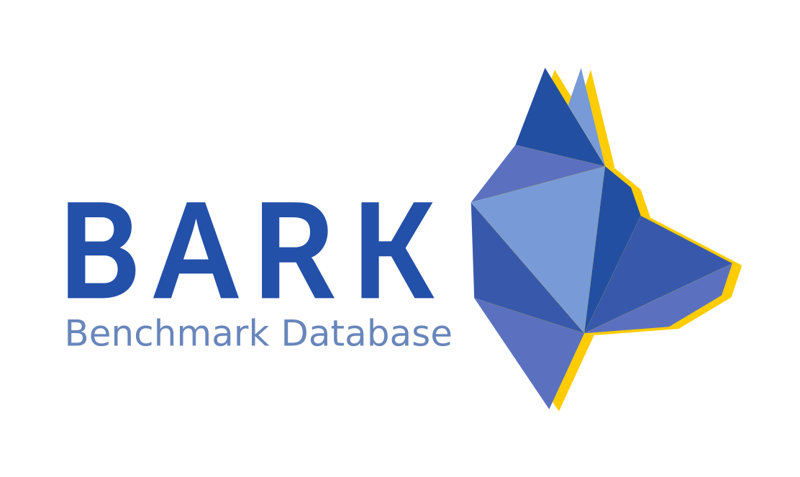

# Bark Benchmark-Database



The benchmark database provides standardized scenarios and maps in
a reprodudible form to ensure that each benchmark is based on the exact same conditions.


## Database Folder Structure
The folder `database` contains the OpenDrive map files in folder `maps` and `scenario_sets`. A scenario set 
is based on a parameter file of a scenario generator
and some additional parameters such as different seeds applied during scenario generation.

We have the following folder structure in `database`:


## How to perform releases?
In a release all scenarios sets specified in `database/scenario_sets` are detected, the specified scenarios are created by calling 
the respective ScenarioGenerator and the created scenarios are serialized into binary files (ending `.bark_scenarios`) into the folder
of the ".json" file. The resulting directory is packed together with the map files into a `.zip`-archive.

### Local Release
We can perform local and github releases. Local releases create only the zip archive into `/tmp/database/release_name.zip"
A local release is run either from the console with:
```
bazel run //serialization:release -- tagname 
```
or within a python script you can pass your own database folder and also specify how:
```
dbs = DatabaseSerializer()
        dbs.process("my_database_root")
        local_release_filename = dbs.release(version="0.0.1")

```

### Github Release
A github release pushes the packed `.zip`-file to the repositories release page. For this, it internally uses the command line tool `ghr`.
Run 
```
bazel run //serialization:release -- tagname --token github_token --delete
```
and pass your own [github token](https://help.github.com/en/articles/creating-a-personal-access-token-for-the-command-line)
and optinally the `--delete` argument if you want to overwrite an existing release tag.

## How to load the database?
The database can either be loaded from github. To see how dependencies must be set up look into bark example `examples/scenarios_from_database.py`.

To load the database from a local release simply pass the filename to the zipfile
```
db = BenchmarkDatabase(database_root=local_release_filename)
```
To get a scenario generator for a specific scenario set, look into the database
 to find the corresponding scenario set id and pass it to `get_scenario_generator`
```
scenario_generation, scenario_set_name = db.get_scenario_generator(scenario_set_id=0)
```

You can also loop over the whole database with
```
for scenario_generator, scenario_set_name in self.benchmark_database:
        process...
```


## How to add your own scenarios?
The creation of scenario sets relies on the ScenarioGeneration base class defined in `bark/runtime/scenario/scenario_generation`.
Derive your own scenario generation class and put the created parameter file into the scenario_set direcotry - 
a new subfolder.


